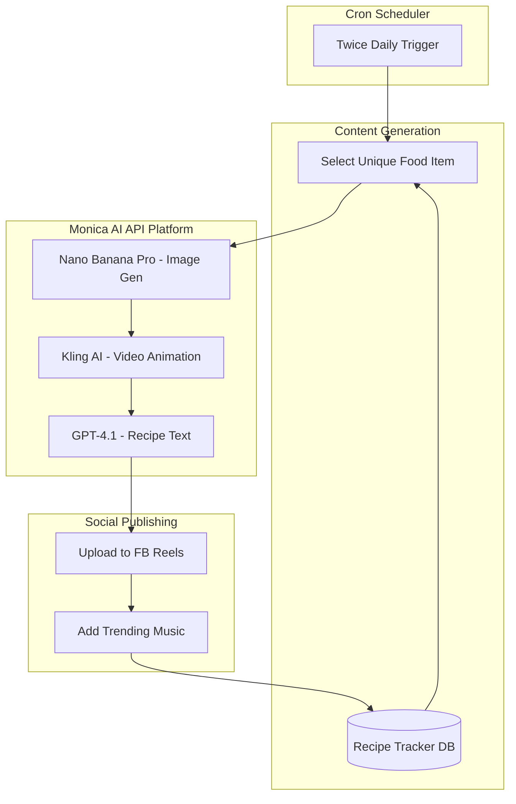

# AI Food Video Workflow - MVP Plan

## Architecture Overview




## Tech Stack

- **Runtime**: Node.js with TypeScript
- **Scheduling**: node-cron (local cron jobs)
- **Database**: SQLite (lightweight, file-based for tracking posted recipes)
- **AI Provider**: [Monica AI API Platform](https://platform.monica.im/) (unified access to multiple models)
- **APIs**:
- Monica API - Image generation (Nano Banana Pro), Video animation (Kling AI), Text generation (GPT-4.1)
- Facebook Graph API - Reels publishing

---

## Project Structure

```javascript
ai-post-maker/
├── src/
│   ├── index.ts              # Main entry point with cron scheduler
│   ├── config.ts             # API keys and configuration
│   ├── services/
│   │   ├── monica/
│   │   │   ├── client.ts     # Monica API client (OpenAI-compatible)
│   │   │   ├── image.ts      # Image generation (Nano Banana Pro)
│   │   │   ├── video.ts      # Video animation (Kling AI)
│   │   │   └── chat.ts       # Text/recipe generation (GPT-4.1)
│   │   └── facebook.ts       # Facebook Reels upload
│   ├── database/
│   │   ├── db.ts             # SQLite connection
│   │   └── recipes.ts        # Recipe tracking (avoid duplicates)
│   ├── prompts/
│   │   ├── imagePrompts.ts   # Food image generation prompts
│   │   └── recipePrompts.ts  # Recipe generation prompts
│   └── utils/
│       ├── foodSelector.ts   # Unique food selection logic
│       └── fileManager.ts    # Temp file handling
├── data/
│   └── recipes.db            # SQLite database
├── temp/                     # Temporary media files
├── package.json
├── tsconfig.json
└── .env                      # API keys (gitignored)
```

---

## Implementation Details

### 1. Food Selection and Duplicate Prevention

Create a curated list of 200+ appealing food items with categories. Track posted recipes in SQLite:

```typescript
// Database schema
interface PostedRecipe {
  id: number;
  foodName: string;
  category: string;
  postedAt: Date;
  imageUrl: string;
  videoUrl: string;
  fbPostId: string;
}
```

Selection logic will:

- Exclude recently posted items (within 30 days)
- Rotate through categories for variety
- Weight towards viral/trending food types

### 2. Monica API Client Setup

Monica API is OpenAI-compatible, making integration straightforward. All AI operations go through a single API provider:

```typescript
// src/services/monica/client.ts
import OpenAI from 'openai';

export const monicaClient = new OpenAI({
  apiKey: process.env.MONICA_API_KEY,
  baseURL: 'https://openapi.monica.im/v1',
});

// Available models for our workflow:
export const MODELS = {
  IMAGE: 'nano-banana-pro',      // Realistic food image generation
  VIDEO: 'kling-ai',             // Image-to-video animation
  CHAT: 'gpt-4.1',               // Recipe text generation
} as const;
```


### 3. Image Generation (Nano Banana Pro via Monica)

Use Monica's image generation endpoint with Nano Banana Pro for hyper-realistic food images:

```typescript
// src/services/monica/image.ts
const prompt = `
Professional food photography of ${foodName}.
Style: Editorial magazine quality, Michelin-star presentation
Lighting: Warm, natural daylight from side
Composition: Close-up, shallow depth of field
Props: Minimal, elegant table setting
Mood: Inviting, appetizing, makes viewer hungry
IMPORTANT: Hyper-realistic, NOT illustrated or AI-looking
Aspect ratio: 9:16 vertical (portrait for Reels)
`;

const response = await monicaClient.images.generate({
  model: 'nano-banana-pro',
  prompt: prompt,
  n: 1,
  size: '1024x1792', // 9:16 aspect ratio
});
```


### 4. Video Animation (Kling AI via Monica)

Monica provides access to Kling AI for image-to-video animation:

```typescript
// src/services/monica/video.ts
// Kling AI creates smooth animations from static images

interface VideoGenerationOptions {
  imageUrl: string;
  duration: number;  // 5-10 seconds for Reels
  motion: 'subtle' | 'moderate' | 'dynamic';
}

async function animateImage(options: VideoGenerationOptions): Promise<string> {
  // Monica API call to Kling AI for image-to-video
  // Returns URL to generated video
}
```

**Alternative Video Models Available via Monica:**

- Runway AI - Professional quality animations
- Pika AI - Creative motion effects
- Hailuo AI - Fast generation
- Stable Video Diffusion - Open model option

### 5. Recipe Generation (GPT-4.1 via Monica)

Use Monica's chat completion endpoint with GPT-4.1 for recipe generation:

```typescript
// src/services/monica/chat.ts
const recipePrompt = `
Create a detailed, authentic recipe for ${foodName}.
Include:
- Prep time and cook time
- Serving size
- Complete ingredient list with measurements
- Step-by-step instructions
- Pro tips for best results
- Calorie estimate

Style: Warm, encouraging, like a friend sharing their secret recipe.
Keep it concise but complete (under 500 words for description).
`;

const response = await monicaClient.chat.completions.create({
  model: 'gpt-4.1',
  messages: [{ role: 'user', content: recipePrompt }],
});
```

**Alternative Chat Models via Monica:**

- Claude Opus 4 / Sonnet 4 - Strong reasoning
- Gemini 2.5 Pro - Google's latest
- GPT-4o - Balanced performance

### 6. Facebook Reels Upload

Use Facebook Graph API for Pages:**Requirements**:

- Facebook Page (not personal profile)
- App with `pages_manage_posts`, `pages_read_engagement` permissions
- Page access token

**Limitations**:

- Music cannot be added programmatically via API
- **Workaround**: Include music suggestion in caption, or post without music initially
```typescript
// Upload flow
1. Upload video to Facebook's video endpoint
2. Create Reel post with video ID
3. Add title, description (recipe), hashtags
```


### 7. Scheduling (node-cron)

```typescript
import cron from 'node-cron';

// Twice daily: 8 AM and 6 PM
cron.schedule('0 8,18 * * *', async () => {
  await generateAndPostFoodReel();
});
```

---

## API Keys Required

Create `.env` file with:

```env
# Monica AI API (unified provider for all AI operations)
MONICA_API_KEY=your_monica_api_key_here

# Facebook Graph API
FB_APP_ID=your_app_id
FB_APP_SECRET=your_app_secret
FB_PAGE_ID=your_page_id
FB_PAGE_ACCESS_TOKEN=your_long_lived_token
```

**Getting Your Monica API Key:**

1. Go to [Monica API Platform](https://platform.monica.im/)
2. Sign in with your paid subscription account
3. Navigate to API Keys section
4. Generate a new API key
5. Add funds to your API balance (separate from subscription)

---

## Known Limitations and Workarounds

| Limitation | Workaround ||------------|------------|| FB API cannot add trending music | Include "Add trending music" reminder in description, or post without music || Monica API balance separate from subscription | Need to add funds specifically for API usage || Long-lived FB tokens expire | Implement token refresh logic || Rate limits on APIs | Add delays between operations, implement retry logic |---

## Future Enhancements (Post-MVP)

1. **Multi-angle videos**: Generate 4-5 images of same dish from different angles, create individual videos, concatenate with ffmpeg
2. **Instagram/YouTube**: Add services for IG Reels API and YouTube Shorts API
3. **Analytics**: Track engagement metrics to optimize food selection
4. **A/B Testing**: Test different prompt styles for higher engagement

---

## Dependencies

```json
{
  "dependencies": {
    "openai": "^4.x",
    "node-cron": "^3.0.3",
    "better-sqlite3": "^11.0.0",
    "axios": "^1.7.0",
    "dotenv": "^16.4.0",
    "form-data": "^4.0.0"
  },
  "devDependencies": {
    "@types/node": "^22.0.0",
    "@types/better-sqlite3": "^7.6.0",
    "@types/node-cron": "^3.0.11",
    "typescript": "^5.6.0",
    "tsx": "^4.19.0"
  }
}
```